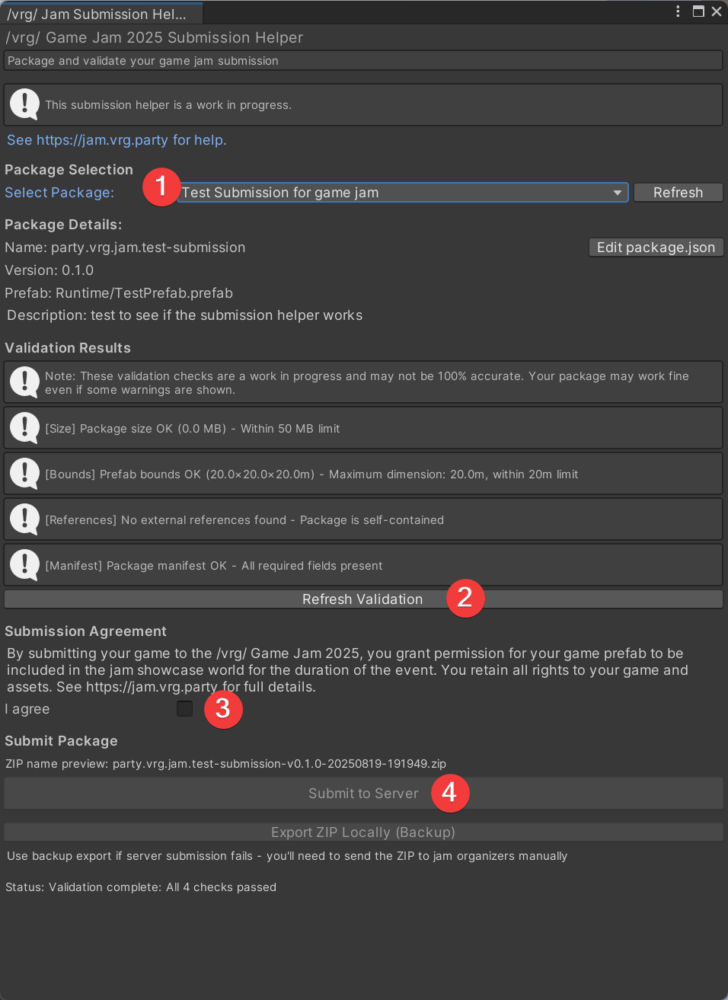
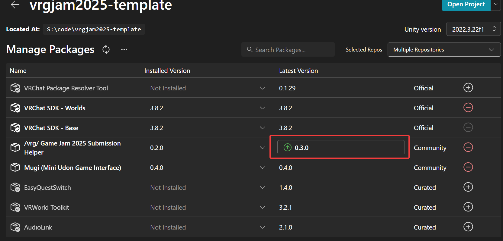

This guide shows you how to submit a game to the /vrg/ game jam. It's similar to the submission process for VRChat worlds or VKet booths.

## Prerequisites

You'll need a package containing your game. If your game isn't in a package yet, follow [VRChat's guide on how to migrate Assets to a package](https://vcc.docs.vrchat.com/guides/convert-unitypackage).

Your package will also need an "entry point" prefab, i.e. the prefab that you expect users to drag into their world to use your prefab.

:::tip
If you don't have a project yet, the [tutorial](/tutorial) will walk you through this with a simple example game (and package). And even if you do have an existing package, the tutorial might be useful to understand the flow with a safe throwaway project.
:::

### Adding the /vrg/ Jam Submission Helper Package

If you don't already have it, you'll have to add the package for the submission helper itself to your Unity project.

import { Steps } from "@astrojs/starlight/components";

<Steps>
  1. Open your web browser and go to
  https://hiinaspace.github.io/vrgjam2025-vpm-repo/ 3. Click the "Add to VCC"
  button at the top, which should open VCC (VRChat Creator Companion) or ALCOM
  if you use that. 5. Click the 'Manage Project' Button on your project. 6.
  Install the `/vrg/ Game Jam 2025 Submission Helper` from the list.
</Steps>

## Modify your package metadata

If you haven't specified it yet, add this field to your package's `manifest.json`.

<Steps>
1. Open your package's `manifest.json` file in a text editor.
2. Update the package metadata to add an `entryPoint` field which points to your root prefab
    ```json title=manifest.json ins={9}
    {
        "name": "...",
        "displayName": "...",
        "description": "...",
        "author": {
            "name": "...",
            "email": "..."
        },
        "prefabEntryPoint": "Runtime/YourEntryPoint.prefab"
    }
    ```
</Steps>

:::caution
If you don't add this field, the helper won't be able to find your package.
:::

## Submission Helper

Open the VRG Game Jam Submission Helper from the menu at the top of the Unity window: `vrg Game Jam 2025 > Submission Helper`:



<Steps>

1. Your package should appear automatically in the dropdown. If you have multiple package in your project, you can select between them.
2. If there are any issues they'll appear in the validation window.
3. Accept the submission agreement.
4. Click "Submit to Server".
5. You're done!

</Steps>

:::tip

<details>
<summary>Don't see the "Submit to Server" button?</summary>
If you don't see it, you might have an old version of the submission helper. Update it in VCC/ALCOM:



</details>
:::

## Submitting updated versions

If you need to update your submission, you can do so by following the same steps as above. We'll use the latest version of your package.

## Help it's broken!

Post the error message you get in the thread and we'll try to fix it. If it's urgent, use the "Export ZIP locally" button and upload it somewhere else (litterbox) and post that.

## How does this work?

It zips up your unity package and uploads it to our server, and we'll manually add all the packages to our world. The server just stores files and does some (very basic) validation.
