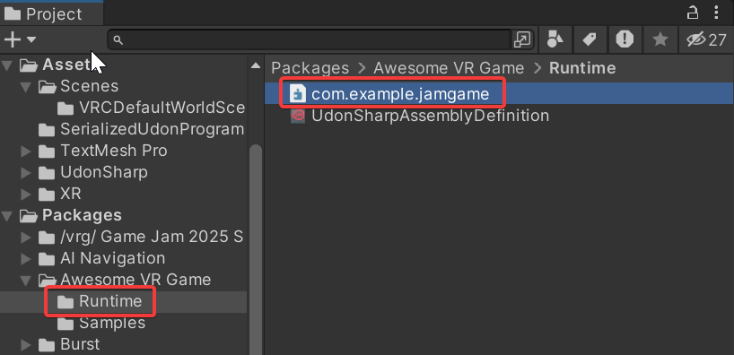
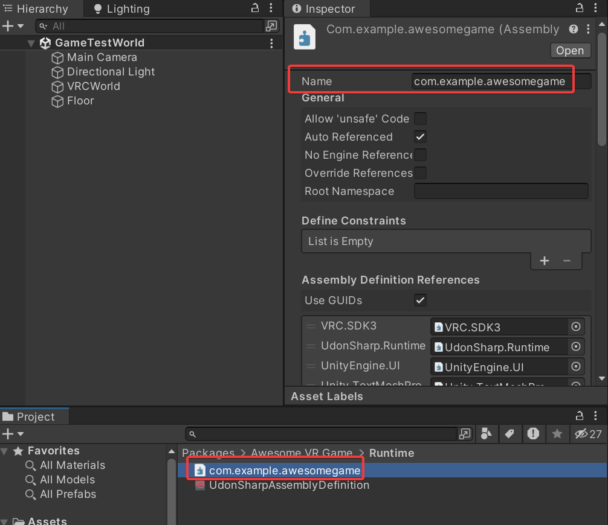

import { Steps } from "@astrojs/starlight/components";

In this tutorial, we'll make a simple game that can be included as a prefab inside any VRChat world.

:::tip
Don't have any game ideas yet? Don't worry, this tutorial requires zero creativity to follow, only your attention. After going through the steps, you might find some inspiration!
:::

## Prerequisites

This tutorial assumes you have [VCC (VRChat Creator Companion)](https://vcc.docs.vrchat.com/) and Unity setup already, and basic familiarity with both. If you don't, do VRChat's own [Creating Your First World](https://creators.vrchat.com/worlds/creating-your-first-world) tutorial first.

## Step 1. Setup

<Steps>

1. [Download the template project as a ZIP](https://github.com/hiinaspace/vrgjam2025-template/archive/refs/heads/main.zip) from GitHub and extract it somewhere on your computer.
2. Open your web browser and go to https://hiinaspace.github.io/vrgjam2025-vpm-repo/
3. Click the "Add to VCC" button at the top, which should open VCC (VRChat Creator Companion):
   
   This ensures you can get both packages and see when they update.
4. Add the extracted template folder as a project.
5. Click the 'Manage Project' Button on the new project. If you see a prompt to "resolve dependencies", accept it (this'll download everything for you).
6. Observe that the `Mugi (Mini Udon Game Interface)` and `/vrg/ Game Jam 2025 Submission Helper` are in the list under `Manage Packages`. (You might get a prompt to download these if they're not there.)
7. Open the project in Unity using the button in VCC.
8. Wait warmly while Unity loads everything.

</Steps>

### Investigate the project structure

While it's loading, check out the project structure in your file browser. The important parts look like (along with some `.meta` files):

import { FileTree } from "@astrojs/starlight/components";

<FileTree>

- Assets
  - ...
- Packages
  - com.example.jamgame
    - manifest.json
    - Runtime
      - com.example.jamgame.asmdef
      - UdonSharpAssemblyDefinition.asset
    - Samples
      - GameTestWorld.unity
      - ...
  - ...

</FileTree>

Unlike a full VRChat world, we're going to do almost all of our work in the `Packages/com.example.jamgame` folder rather `Assets/`. This is because when somebody includes your game in their world, they'll also see your package as separate from the rest of the their assets.

:::note
If you look in the Console of Unity and see a bunch of errors, don't despair. The errors are usually spurious. Press the "Clear" button in the upper-left of the console to hopefully make 'em go away.
:::

## Step 2: Rename Your Package

<Steps>

1. In Unity's browser, navigate to `Packages/!/vrg/ Template Package'`.
2. Right click the folder and "Show in Explorer"
3. In Explorer, notice that the folder is called `com.example.jamgame` instead.
4. Right-click the folder and rename it to `com.example.awesomegame` so don't conflict with other packages using the same template.
5. Open the `package.json` file inside this folder.
6. Update the package metadata `name` and `displayName` fields (leaving the rest of the fields as they are):
   ```json title=package.json ins=/com.example.awesomegame|Awesome VR Game/
   {
       "name": "com.example.awesomegame",
       "displayName": "Awesome VR Game",
       ...
   }
   ```
7. Back in Unity's Project browser, notice that your package now shows up as `Packages/Awesome VR Game`. The `displayName` field from the metadata is what unity displays, while Explorer shows the folder name: `com.example.awesomegame`.

</Steps>

## Step 3: Rename the Assembly Definition

<Steps>

1. In the Runtime folder of your package, notice the `com.example.jamgame` Assembly Definition file:
    
    (in the file browser, its extension is `.asmdef`).
2. Rename the file to `com.example.awesomegame` to match the overall package.
3. In the inspector for the file, also rename it to `com.example.awesomegame`.
   

</Steps>

:::note[Aside]{icon="puzzle"}
<details>
<summary>What's the Assembly Definition for? Why do you have to rename it in two places?</summary>

Roughly, it keeps the code of your package isolated from the rest of the code in unity. It also interacts with the UdonSharp compiler in an odd way. If you don't rename it and make sure both the inspector name and the file name match, UdonSharp will break with an error like:

```text wrap
[UdonSharp] Script 'Packages/com.example.awesomegame/Runtime/CapsuleClicker.cs' does not belong to a U# assembly, have you made a U# assembly definition for the assembly the script is a part of?
```

I think this is a bug, but I can't tell for sure. The root cause is [this line in UdonSharp's compiler](https://github.com/MerlinVR/UdonSharp/blob/1fee37795f935c0417ebe71f9632c2358751fba2/Packages/com.merlin.UdonSharp/Editor/Compiler/Udon/CompilerUdonInterface.cs#L160-L161), which requires the filename and assembly name to match exactly.
</details>
:::

## Step 4: Create a new MugiGame-based Prefab

<Steps>

1. In the Project window, navigate to `Packages/Awesome VR Game/Runtime`
2. Right Click in the window and click `Create -> Mugi -> Mugi Game Variant`.
3. Save the new prefab as `MyAwesomeGame.prefab`.
2. Double-click `MyAwesomeGame.prefab` to open it in prefab editing mode
3. This prefab contains the MugiGame framework components at the root.

</Steps>

## Step 5: Add a Capsule

<Steps>

1. In the prefab hierarchy, right-click and create `3D Object > Capsule`
2. Name it "ScoreButton"
3. Position it at the center of the scene (0, 0, 0)

</Steps>

## Step 6: Create the CapsuleClicker Script

Now we'll add some behavior.

<Steps>

1. In the Project window, navigate to `Assets/` (not the Package)
2. Right-click and create `Create > U# Script`
3. Name it `CapsuleClicker`.
4. In the Project window, see that it created a `CapsuleClicker.cs` and a `CapsuleClicker.asset` beside it (you may see two different icons instead of extensions).
4. Move both the new `CapsuleClicker.cs` and `CapsuleClicker.asset` into your `Packages/Awesome VR Game/Runtime` directory.
5. Open the script. The default script looks like:
    ```csharp title=CapsuleClicker.cs
    using UdonSharp;
    using UnityEngine;
    using VRC.SDKBase;
    using VRC.Udon;

    public class CapsuleClicker : UdonSharpBehaviour
    {
        void Start()
        {

        }
    }
    ```

</Steps>

:::note[Aside]{icon="puzzle"}
<details>
<summary>Why do you have to create the U# Script in `Assets` and move it?</summary>

If try to create the script directly in your package's Runtime directory, it'll (sometimes) fail to create the extra UdonSharpProgramAsset alongside it (the thing with the same name and green logo).

This some other bug in UdonSharp. Creating scripts in `/Assets` first and moving them seems to work around it.

</details>
:::

## Step 7: Implementing the script

First, let's add a namespace to the script, so it won't conflict with other packages:

```csharp title=CapsuleClicker.cs ins={5-6,14}
using UdonSharp;
using UnityEngine;
using VRC.SDKBase;

namespace Com.Example.AwesomeGame
{
    public class CapsuleClicker : UdonSharpBehaviour
    {
        void Start()
        {

        }
    }
}
```

Then we'll add a reference to the MugiGame behavior itself:

```csharp title=CapsuleClicker.cs ins={4,10}
using UdonSharp;
using UnityEngine;
using VRC.SDKBase;
using Space.Hiina.Mugi;

namespace Com.Example.AwesomeGame
{
    public class CapsuleClicker : UdonSharpBehaviour
    {
        public MugiGame mugiGame;

        void Start()
        {

        }
    }
}
```

Then finally we'll implement the Interact method, which gets called when you click on a thing in Udon:

```csharp title=CapsuleClicker.cs ins={17-25}
using UdonSharp;
using UnityEngine;
using VRC.SDKBase;
using Space.Hiina.Mugi;

namespace Com.Example.AwesomeGame
{
    public class CapsuleClicker : UdonSharpBehaviour
    {
        public MugiGame mugiGame;

        void Start()
        {

        }

        public override void Interact()
        {
            VRCPlayerApi localPlayer = Networking.LocalPlayer;
            if (mugiGame.gameState == MugiGame.STATE_RUNNING &&
                mugiGame.IsPlayerInGame(localPlayer))
            {
                mugiGame.IncrementScore(localPlayer.playerId, 1);
            }
        }
    }
}
```

Now, when you click the capsule and you're in the game, your score goes up. Don't worry too much about the details for now.

While we're here, we're also going to add some debug logging:

```csharp title=CapsuleClicker.cs ins={19,24}
using UdonSharp;
using UnityEngine;
using VRC.SDKBase;
using Space.Hiina.Mugi;

namespace Com.Example.AwesomeGame
{
    public class CapsuleClicker : UdonSharpBehaviour
    {
        public MugiGame mugiGame;

        void Start()
        {

        }

        public override void Interact()
        {
            Debug.Log("Capsule Clicked!");
            VRCPlayerApi localPlayer = Networking.LocalPlayer;
            if (mugiGame.gameState == MugiGame.STATE_RUNNING &&
                mugiGame.IsPlayerInGame(localPlayer))
            {
                Debug.Log("Incrementing Score!");
                mugiGame.IncrementScore(localPlayer.playerId, 1);
            }
        }
    }
}
```

Debug logging is good for you.

## Step 8: Attach the Script and Reference

<Steps>
1. Select the "ScoreButton" capsule in the prefab hierarchy
2. Click "Add Component" and add your `CapsuleClicker` script
3. In the script component, drag the root `MyAwesomeGame` object into the "Mugi Game" field.
</Steps>

## Step 9: Configure Game Settings

<Steps>
1. Select the root `MyAwesomeGame` object in the prefab hierarchy
2. In the `MugiGame` component, configure:
   - **Game Time Limit**: 30 seconds (default 300)
   - **Min Players**: 1 (default 2)
3. Save the prefab.
</Steps>

We change these so when we're testing, we don't have to figure out multiplayer or wait 5 minutes for the game to end.

## Step 10: Add your prefab to the Test Scene

<Steps>
1. Navigate to `Packages/My Awesome Game/Samples`
2. Open the `GameTestWorld.unity` scene.
3. Navigate to the `Packages/My Awesome Game/Runtime` in the browser.
4. Drag your `MyAwesomeGame` prefab into the scene.
</Steps>

You should see the scoreboard and your capsule visible now. Move it to (0,0,0) if it's not.

## Step 11: Test Your Game in Play Mode

<Steps>
1. Enter Play Mode in Unity.
2. In the Game window, dismiss the Client Sim UI.
3. Observe your capsule and the UI provided by Mugi.
4. Join the game using the lobby UI.
5. Start the game using the lobby UI.
6. Click the capsule to increment your score
7. Look in the Console, and see the log messages that say "Capsule Clicked" and "Score Incremented".
8. Once the game ends, see your final score on the scoreboard.
9. Exit Play Mode.
</Steps>

## Step 12: Submit Your Game

<Steps>
1. Open your package's `package.json` file in a text editor.
2. Change the `entryPoint` field to refer to your root prefab:
    ```json title=package.json ins="Runtime/MyAwesomeGame.prefab"
    {
        ...,
        "prefabEntryPoint": "Runtime/MyAwesomeGame.prefab"
    }
    ```
3. Open the VRG Game Jam Submission Helper from menu at the top of the Unity window: `vrg Game Jam 2025 > Submission Helper`
4. The Helper window should automatically detect your package.
5. Click "Refresh Validation" to check for issues. There may be some. You can ignore those for now (WIP)
6. Accept the submission agreement.
7. Click "Submit to Server".
</Steps>

:::note
It's fine to submit things to the server to test that it works. We'll filter out any tutorial submissions.
:::


## Step 13: Upload and Test in VRChat (Optional)

<Steps>
1. Open the VRChat SDK window from VRChat SDK -> Show Control Panel.
2. Name the world "Awesome game test"
3. Click "Capture in Scene" to make a thumbnail image.
4. Click the "Build & Publish" button.
5. Test the world with your friends (and/or alt accounts)
</Steps>

## Reflection

You now have a working game submitted to the jam, and a demo world!

## Next Steps

Check out the [Mugi docs](/mugi) to see what else you can do with the framework. Also check out the [Resources](/resources) for more useful tips when making your real game.

import { Card, CardGrid, LinkCard } from '@astrojs/starlight/components';

<CardGrid>
    <LinkCard title="Mugi Docs" href="/mugi" />
    <LinkCard title="Resources" href="/resources" />
</CardGrid>

## Help! it didn't work!

If you got stuck somewhere or a step doesn't make sense, post about it in the thread so we can try to fix both your problem and the tutorial.

Unity, Udon, and really gamedev in general is unfortunately pretty haunted. While it's a total cope, sometimes deleting the entire project and trying the same steps again will fix things.
