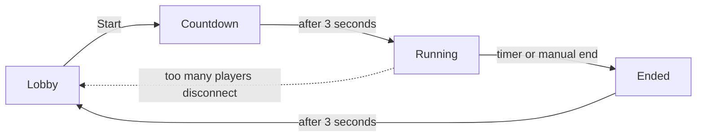
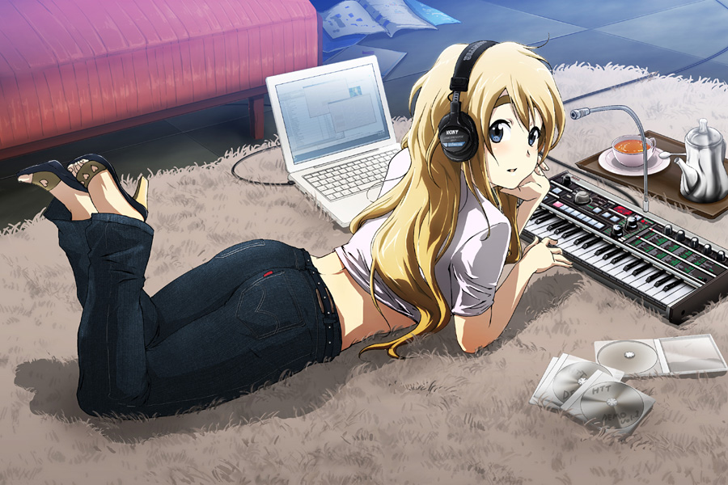

Mugi is a framework for creating games as prefabs in VRChat worlds. It gives you a robust implementation of:

- Lobby UI and management for both Free-for-all and Teams
- Game Lifecycle (Start/Stop/Reset)
- Scoring with Scoreboard UI
- Game Clock/Timelimit
- Disable/Enable behavior

i.e. all the usual things you'd expect out of a game prefab.

Mugi also happens to check most of the guidelines for the [Jam Rules](/rules). However, you're not required to use it. And if you want to make a game without submitting to the Jam, feel free to use Mugi as well. It's fully free and open source (WTFPL).

## Demo Video

TODO

## How to Use

:::note
Also see the [Tutorial](/tutorial) for a more practical/hands-on intro.
:::

### Installation

1. Install the [Vrchat Creator Companion (VCC)](https://vcc.docs.vrchat.com/) or [ALCOM](https://vrc-get.anatawa12.com/alcom/) first.
2. Visit https://hiinaspace.github.io/vrgjam2025-vpm-repo/ and press the "Add to VCC" button.
3. Click the "Manage" button for your project, and install the "Mugi (Mini Udon Game Interface)" package.

### Basic Usage

1. Right click somewhere in either your scene hierarchy or the Unity asset browser, and choose Create -> Mugi-based Game. This'll create a new prefab for you to build your game inside, along with a LobbyUI and Scoreboard (UI Canvasses).
2. Add assets for your game as children of the prefab.
3. Configure min/max players and teams in the MugiController.
4. Set up callback UdonBehaviours to respond to game events
5. Use `MugiController.IncrementScore()` and [other methods](#api-reference) in your game logic.

## Architecture

### MugiGame

An UdonSharpBehavior on root gameobject of your prefab. It runs the show essentially. Other parts of your game will have a reference to it in order to get the active players in the game, get the current game state, and manipulate player scores.

The default MugiGame prefab includes the MugiLobbyUI and MugiScoreboard as children. You'll put any other gameobjects you need for your game alongside them.

MugiGame will pause completely if its GameObject is turned off, and will resume if it the GameObject is turned back on, so you can add toggles for games built on Mugi. the toggle state isn't synced internally, so it's possible for non-players to turn off a MugiGame as well without affecting others. (If you don't want this behavior though, you'll have to implement a synced toggle yourself).

### Lobby UI

MugiLobbyUI is a world-space 2d Canvas UI that gives you the usual lobby behavior, i.e.

- Players can click the Join button to join the lobby, and everyone in the instance can see the current players.
- The first player to join is the "Game Master" and can start the game (and stop it early).
- If teams are enabled, players can join/switch/leave teams freely.

MugiLobbyUI is optional; MugiGame supports callbacks to add/remove players itself if you want to build your own lobby.

### Scoreboard

MugiScoreboard is another world-space 2d Canvas UI that shows the current scores of all players in a game in progress, or the last known scores and ranks of players from a game that's ended.

MugiScoreboard is similarly optional, if you want to build your own way to show player scores and winners.

### Networking and Ownership

MugiGame uses VRChat's networking system with a **Game Master** pattern:

**Game Master Role:**
- The first player to join becomes the Game Master (owner of the MugiGame object)
- Only the Game Master can start/stop games and process score changes
- Game Master handles all networked state changes and validation

**Ownership Transfer:**
When the Game Master leaves, MugiGame automatically promotes a new Game Master:
1. **Priority 1**: Active game players (lowest player ID)
2. **Priority 2**: Any remaining players in instance (lowest player ID)

There's no current facility to voluntarily change the game master other than having all players leave the lobby and the new game master join first.

### Game Lifecycle

Mugi operates as a state machine, with the current state accessible as `MugiGame.gameState`:



#### Lobby

The default state. Players join and leave the game using the MugiLobbyUI (or with a custom UI).
The first player to join is the **Game Master** (indicated by a star next to their name in the LobbyUI). If the minimum number of players have joined, then the Game Master can start the game, transitioning to the Countdown state.

#### Countdown

Players can no longer join/leave the game. The Lobby UI displays a short countdown. This is a good time to use the `OnMugiCountdown` countdown to do things like teleport players to new positions or enable more expensive Udon behaviors (e.g. with Update()).

After the countdown, the game transitions automatically to the Running state.

#### Running

The main game clock will tick down during this state. The MugiScoreboard will update with the live scores from other players.

The game will transition to the Ended state either when the clock reaches zero, or `MugiGame.EndGameEarly()` is called.

If players disconnect from the VRChat instance during the game and number of players falls below the minimum, the game will transition back to the Lobby state.

#### Ended

A short cooldown state after the game ends. Will transition to the Lobby state after 3 seconds.

### Scoring

MugiGame keeps track of a numeric score per player. The score is an arbitrary integer (can be negative).

If enabled teams don't have scores themselves. The default MugiScoreboard implements team scores/ranks by simply summing the each player's score within it.

## API Reference

### Game States

```cs
// Check current game state
if (mugiGame.gameState == MugiGame.STATE_LOBBY) { /* players joining */ }
if (mugiGame.gameState == MugiGame.STATE_COUNTDOWN) { /* 3-sec countdown */ }
if (mugiGame.gameState == MugiGame.STATE_RUNNING) { /* active gameplay */ }
if (mugiGame.gameState == MugiGame.STATE_ENDED) { /* brief end state */ }

// Get time remaining in current state (countdown or game time)
float timeLeft = mugiGame.timeRemaining;
```

### Player Info

```cs
// Check if a player is currently in the game
bool inGame = mugiGame.IsPlayerInGame(player);

// Get all players currently in the game
VRCPlayerApi[] players = mugiGame.GetPlayersInGame();

// Get a player's team index (-1 if not in game, 0 for FFA)
int teamIndex = mugiGame.GetPlayerTeam(player);

// Get team name for display
string teamName = mugiGame.GetTeamName(teamIndex);
```

### Game Control

```cs
// Check if game has enough players to start
bool canStart = mugiGame.IsGameReady();

// Start the game (only game master can call)
mugiGame.StartGame();

// End the game early (only game master can call)
mugiGame.EndGameEarly();

// Get time remaining in current state
float timeLeft = mugiGame.GetRemainingTime();
```

### Player Scores

These are the main methods you'll use to interact with mugi.

```cs
// Add to a player's score (networked, only works during STATE_RUNNING)
mugiGame.IncrementScore(player.playerId, 10);

// Set a player's score directly (networked, only works during STATE_RUNNING)
mugiGame.SetScore(player.playerId, 100);

// Get a player's current score
int score = mugiGame.GetPlayerScore(player);
int score = mugiGame.GetPlayerScore(playerId);

// Get total score for a team (sum of all players on team)
int teamScore = mugiGame.GetTeamScore(teamIndex);
```

:::caution
Each score modification requires a network RPC subject to [rate limiting](https://creators.vrchat.com/worlds/udon/networking/events#rate-limiting). If you update the scores a lot (e.g. in an `Update()` loop), you'll need to add some locally-managed state and periodically synchronize it with `SetScore`).
:::

### Lobby Management

:::note
If you use the default MugiLobbyUI, you probably won't need to call these methods.
:::

```cs
// Request to join the game (becomes networked call to game master)
mugiGame.RequestJoinGame(player.playerId);

// Request to leave the game (becomes networked call to game master)
mugiGame.RequestLeaveGame(player.playerId);

// Request to join a specific team (becomes networked call to game master)
mugiGame.RequestJoinTeam(player.playerId, teamIndex);
```

### Callback System

Mugi can call public methods on arbitrary UdonBehaviors at different points of the game lifecycle. To register callbacks, add your UdonBehavior to the appropriate array field on the MugiGame component, e.g. by dragging the gameobject into the inspector.

#### Event Methods

| Method Name | When Called | Use For |
|--------|-------------|---------|
| `OnMugiCountdown` | Game enters countdown state | Setup like teleporting players or enabling expensive behaviors |
| `OnMugiStart` | Gameplay begins (after countdown) | Game timer starts here, initialize game mechanics |
| `OnMugiEnd` | Game finishes (timer expired or manual end) | Cleanup and result processing |
| `OnMugiPlayerJoin` | Player joins the lobby | Handle new player setup, access player info via MugiGame API |
| `OnMugiPlayerLeave` | Player leaves (disconnection or manual) | Handle any player-specific cleanup |
| `OnMugiTimeWarning` | Once when 30 seconds remain | "Hurry up" effects or warnings |

#### Example Implementation

```cs title=MyGameBehavior.cs
public class MyGameBehavior : UdonSharpBehaviour
{
    public MugiGame mugiGame;

    public void OnMugiStart()
    {
        // Enable game mechanics when game starts
        gameObject.SetActive(true);

        // Get all players and do something
        VRCPlayerApi[] players = mugiGame.GetPlayersInGame();
        // ... your game logic
    }

    public void OnMugiEnd()
    {
        // Disable expensive behaviors
        gameObject.SetActive(false);
    }
}
```

## I scrolled all the way through your dumb readme, where da anime grills at?

Fine, here's my favorite 'mugi pic:



Source: https://danbooru.donmai.us/posts/564622
